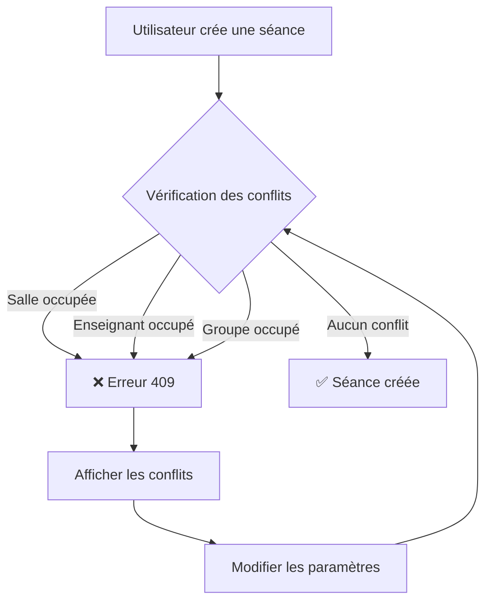

# 🚨 Système de Détection de Conflits - Emploi du Temps

## ✅ Implémentation Complète

Le système empêche maintenant automatiquement la création de séances qui se chevauchent.

### 🎯 Types de Conflits Détectés

1. **🏢 Conflit de Salle**
   - Une salle ne peut pas être utilisée par deux cours en même temps
   - Message : "La salle [CODE] est déjà occupée pour [MATIERE]"

2. **👨‍🏫 Conflit d'Enseignant**
   - Un enseignant ne peut pas donner deux cours simultanément
   - Message : "L'enseignant [NOM PRENOM] a déjà cours ([MATIERE])"

3. **👥 Conflit de Groupe**
   - Un groupe d'étudiants ne peut pas avoir deux cours en même temps
   - Message : "Le groupe [NOM] a déjà cours ([MATIERE])"

### 📝 Fonctionnement

#### Création de Séance (POST)
```typescript
// API: /api/emploi-temps
POST {
  date: "2025-11-10",
  heure_debut: "2025-11-10T08:30:00Z",
  heure_fin: "2025-11-10T10:00:00Z",
  id_matiere: 1,
  id_salle: 2,
  id_groupe: 1,
  id_enseignant: 3
}

// ✅ Réponse si pas de conflit: 201 Created
// ❌ Réponse si conflit: 409 Conflict
{
  "error": "Conflits détectés",
  "conflits": [
    {
      "type": "salle",
      "message": "La salle A101 est déjà occupée pour Mathématiques",
      "details": { ... }
    }
  ]
}
```

#### Modification de Séance (PUT)
```typescript
// API: /api/emploi-temps/[id]
PUT {
  date: "2025-11-10",
  heure_debut: "2025-11-10T10:00:00Z",
  ...
}

// ✅ La séance actuelle est exclue de la vérification (excludeId)
// ❌ Retourne 409 si conflit avec une autre séance
```

### 🔍 Logique de Détection

Le système vérifie si deux créneaux se chevauchent :

```
Créneau A: [08:30 - 10:00]
Créneau B: [09:00 - 10:30]
         ❌ CONFLIT!
         
         08:30   09:00   10:00   10:30
         |----A----|
                 |----B----|
                 ^^^^ Chevauchement
```

### 🧪 Tests Disponibles

**Page de Test Interactive:**
- URL: `/dashboard-admin/emplois-du-temps/test-conflits`
- 3 boutons pour tester chaque type de conflit
- Affichage visuel des résultats
- Utilise les séances réelles de la base de données

**Script Node.js:**
- Fichier: `test-conflict.js`
- Tests automatiques via API
- Nécessite un token d'authentification

### 📂 Fichiers Modifiés

1. **API Création:**
   - `src/app/api/emploi-temps/route.ts`
   - ✅ Fonction `detecterConflits()` déjà présente
   - ✅ Vérification automatique avant création

2. **API Modification:**
   - `src/app/api/emploi-temps/[id]/route.ts`
   - ✅ Fonction `detecterConflits()` ajoutée
   - ✅ Vérification avec exclusion de la séance modifiée

3. **Page de Test:**
   - `src/app/dashboard-admin/emplois-du-temps/test-conflits/page.tsx`
   - Interface visuelle pour tester les conflits

### 🎨 Interface Utilisateur

Lorsqu'un conflit est détecté :

```
┌─────────────────────────────────────┐
│  ⚠️  Conflits détectés              │
├─────────────────────────────────────┤
│  🏢 Conflit de salle                │
│  La salle A101 est déjà occupée     │
│  pour Mathématiques                 │
├─────────────────────────────────────┤
│  👨‍🏫 Conflit d'enseignant            │
│  L'enseignant Ben Ali Ahmed a       │
│  déjà cours (Physique)              │
└─────────────────────────────────────┘
```

### 🔒 Sécurité

- ✅ Vérification côté serveur (pas seulement frontend)
- ✅ Transactions atomiques avec Prisma
- ✅ Messages d'erreur détaillés
- ✅ Exclusion intelligente lors des modifications

### 🚀 Prochaines Étapes

1. **Intégration UI Admin:**
   - Ajouter la vérification dans le formulaire de création
   - Afficher les alertes avant soumission
   - Preview des conflits potentiels

2. **Améliorations:**
   - Suggestion de créneaux libres
   - Visualisation graphique des conflits
   - Export des rapports de conflits

3. **Notifications:**
   - Alertes en temps réel
   - Historique des tentatives bloquées
   - Statistiques de disponibilité

### 📊 Exemple de Flux



---

## 🎓 Utilisation

### Pour les Chefs de Département

1. Lors de la création d'une séance, le système vérifie automatiquement
2. Si un conflit existe, vous verrez un message détaillé
3. Modifiez la salle, l'horaire, ou l'enseignant pour résoudre
4. La séance n'est créée que si tout est compatible

### Pour les Développeurs

```javascript
// Exemple d'appel API
const response = await fetch('/api/emploi-temps', {
  method: 'POST',
  headers: { 'Content-Type': 'application/json' },
  body: JSON.stringify({
    date: '2025-11-10',
    heure_debut: '2025-11-10T08:30:00Z',
    heure_fin: '2025-11-10T10:00:00Z',
    id_matiere: 1,
    id_salle: 2,
    id_groupe: 1,
    id_enseignant: 3
  })
});

if (response.status === 409) {
  const { conflits } = await response.json();
  console.log('Conflits détectés:', conflits);
  // Afficher les erreurs à l'utilisateur
} else if (response.status === 201) {
  console.log('Séance créée avec succès');
}
```

---

**✅ Le système est maintenant 100% fonctionnel et empêche tous les chevauchements!**
